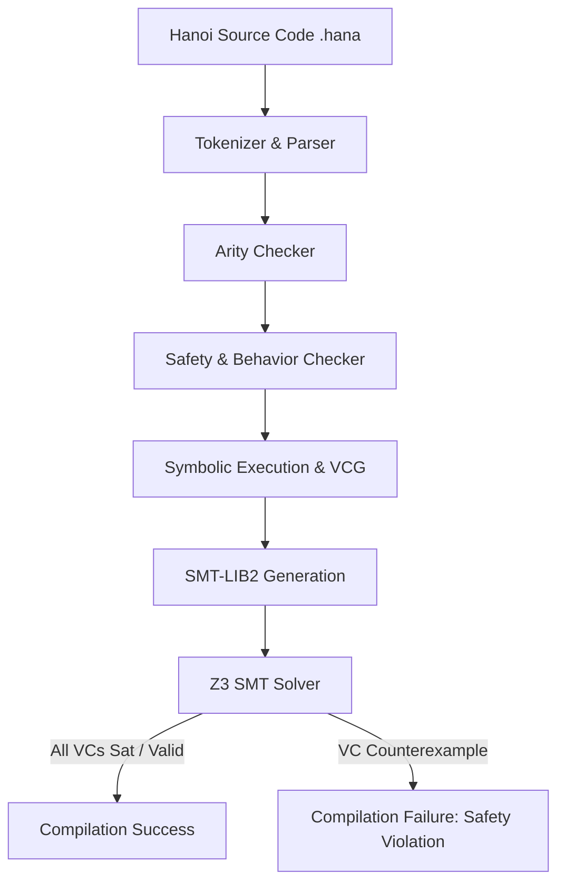

# Design Specification: Safety and Behavior Contract Checker for Hanoi

This document outlines the design for a static safety and behavior checker for the Hanoi language. The system allows developers to annotate Hanoi `sentence`s and `function`s with logical contracts. The static checker then verifies that functions do not panic under their annotated preconditions and that they conform to their declared behaviors.

---

## 1. Goal Description

Hanoi is a stack-based VM-executed language. Functions (or sentences) can fail or panic at runtime due to multiple factors:
1. **Assertion Failures**: Explicit panic triggers via `assert` or `assert_eq`.
2. **Type/Domain Errors**: e.g., division/modulo by zero, non-numeric values passed to arithmetic operations, or accessing non-tuple values.
3. **Invalid Operations**: Calling `set_choose` on infinite sets or index out-of-bounds on symbols.
4. **Stack Underflow**: Trying to pop elements when the stack is empty (largely prevented by arity checks, but must be preserved).

Our goal is to design:
- **A logical contract syntax** using annotations (attributes) on Hanoi sentences.
- **A static checker** that parses these contracts, symbolically executes Hanoi's bytecode, generates Verification Conditions (VCs), and uses an SMT solver (such as Z3) to prove them.

---

## 2. Syntax Design

### 2.1 Annotations in `.hana`

We propose introducing two new attributes to the language syntax:
1. `#[safety("formula")]`: Declares the **precondition** under which the function is guaranteed not to panic.
2. `#[behavior("formula")]`: Declares the **postcondition** (the relation between inputs and outputs) when the function executes successfully.

Both attributes accept a string literal containing the logical formula. Using string literals has three major advantages:
1. **Decoupled Tokenization**: It prevents polluting the main Hanoi tokenizer with operators like `==`, `&&`, `<=`, etc., that are not part of Hanoi's base bytecode syntax.
2. **Parser Extensibility**: It allows the formula parser to evolve independently of the main compiler parser.
3. **User-Friendly**: It directly supports complex logical operators without parsing conflicts.

#### Example:
```hana
#[arity(2, 1)]
#[safety("in[0] != 0")]
#[behavior("out[0] == in[1] / in[0]")]
sentence safe_divide {
    divide
}

#[arity(2, 0)]
#[safety("in[0] == in[1]")]
sentence assert_eq_wrapper {
    assert_eq
}
```

### 2.2 Formula Grammar

The formula language inside the string literal supports booleans, integers, comparisons, arithmetic, logical operators, and tuple destructuring.

```
Formula := Conj

Conj := Disj ( "&&" Disj )*

Disj := Impl ( "||" Impl )*

Impl := Comp ( "==>" Comp )*

Comp := Expr ( "==" | "!=" ) Expr
      | Expr

Expr := Term ( ( "+" | "-" ) Term )*

Term := Factor ( ( "*" | "/" | "%" ) Factor )*

Factor := "!" Factor
        | "-" Factor
        | "in" "[" Int "]"                 // Input stack elements (0-indexed from top)
        | "out" "[" Int "]"                // Output stack elements (0-indexed from top)
        | "in" "[" Int "]" "." Int         // Tuple element access, e.g., in[0].1
        | "out" "[" Int "]" "." Int        // Tuple element access, e.g., out[0].0
        | Identifier                       // e.g. boolean literals (true, false)
        | Int                              // Integer literal
        | "(" Formula ")"
```

---

## 3. Safety & Behavior contracts for Hanoi Bytecode Instructions

The checker must have built-in knowledge of the safety preconditions and behavior postconditions for all core instructions defined in [opcode.rs](file:///home/hjfreyer/hanoi/bytecode/src/opcode.rs). 

Below is the mapping for each primitive instruction. We denote the input stack as `in` (where `in[0]` is the top of the stack) and the output stack as `out` (where `out[0]` is the top of the stack).

| Instruction | Inputs | Outputs | Safety Precondition | Behavior Postcondition |
| :--- | :--- | :--- | :--- | :--- |
| `Push(V)` | 0 | 1 | `true` | `out[0] == V` |
| `Drop(d)` | $d+1$ | $d$ | `true` | `out[k] == (k < d ? in[k] : in[k+1])` |
| `Pick(d)` | $d+1$ | $d+2$ | `true` | `out[0] == in[d] && out[k+1] == in[k]` |
| `Roll(d)` | $d+1$ | $d+1$ | `true` | `out[0] == in[d] && out[k+1] == in[k] (for k < d) && out[k] == in[k] (for k > d)` |
| `Add` | 2 | 1 | `is_numeric(in[0]) && is_numeric(in[1])` | `out[0] == in[1] + in[0]` |
| `Subtract` | 2 | 1 | `is_numeric(in[0]) && is_numeric(in[1])` | `out[0] == in[1] - in[0]` |
| `Multiply` | 2 | 1 | `is_numeric(in[0]) && is_numeric(in[1])` | `out[0] == in[1] * in[0]` |
| `Divide` | 2 | 1 | `is_numeric(in[0]) && is_numeric(in[1]) && in[0] != 0` | `out[0] == in[1] / in[0]` |
| `Modulo` | 2 | 1 | `is_numeric(in[0]) && is_numeric(in[1]) && in[0] != 0` | `out[0] == in[1] % in[0]` |
| `Equal` | 2 | 1 | `true` | `out[0] == (in[1] == in[0])` |
| `Not` | 1 | 1 | `is_bool(in[0])` | `out[0] == !in[0]` |
| `Negate` | 1 | 1 | `is_numeric(in[0])` | `out[0] == -in[0]` |
| `Assert` | 1 | 0 | `in[0] == true` | `true` |
| `AssertEqual`| 2 | 0 | `in[0] == in[1]` | `true` |
| `Tuple(n)` | $n$ | 1 | `true` | `out[0] == (in[0], ..., in[n-1])` |
| `Untuple(n)` | 1 | $n$ | `is_tuple(in[0]) && len(in[0]) == n` | `out[k] == in[0].k` |
| `SymbolLen` | 1 | 1 | `is_symbol(in[0])` | `out[0] == len(in[0])` |
| `SymbolCharAt`| 2 | 1 | `is_symbol(in[1]) && is_int(in[0]) && in[0] >= 0 && in[0] < len(in[1])` | `out[0] == char_at(in[1], in[0])` |

> [!WARNING]
> **Set instructions are deprecated and not supported**:
> - `SetContains`, `SetUnion`, `SetIntersection`, `SetDifference`, `SetComplement`, `SetSingleton`, `SetTuple`, `SetRenamePrefix` are ignored or raise errors because sets are deprecated.
> - Encountering `SetChoose` (or `set_choose`) at any point during safety checking yields a **compilation safety error** immediately.

---

## 4. Checker Architecture

The checker operates as a modular static validator integrated directly into the compiler pipeline after parser/arity validation.



### 4.1 Symbolic Execution & VCG Algorithm

The checker processes each compiled sentence $S$ (of index $s\_idx$ with arity $N \rightarrow M$) independently:

1. **Initialize State**:
   - Create symbolic input variables $x_{in,0}, x_{in,1}, \dots, x_{in,N-1}$.
   - Initialize the symbolic stack: `stack = [x_{in, N-1}, ..., x_{in, 1}, x_{in, 0}]`.
   - Retrieve safety precondition $P_S$ and behavior postcondition $Q_S$ for $S$. If unannotated, $P_S = \text{true}$ and $Q_S = \text{true}$.
   - Set Path Condition $PC = P_S$.
   - Set Verification Conditions set $VC = \emptyset$.

2. **Step through Instructions**:
   For each instruction $I$ in $S$:
   - For any instruction $I$ that requires $K$ elements:
     - Pop $K$ symbolic values $v_0, \dots, v_{K-1}$ from the `stack`.
     - Let $Pre_I$ be the safety precondition of $I$ under substitution $in[k] \mapsto v_k$.
     - Add to Verification Conditions: $VC \leftarrow VC \cup \{ PC \implies Pre_I \}$.
     - If $I$ is an assertion (`Assert`, `AssertEqual`), also update the path condition: $PC \leftarrow PC \land Pre_I$.
     - If $I$ is `Panic`, add $PC \implies \text{false}$ to $VC$ (proving the path is unreachable).
     - Push the outputs of $I$ (as symbolic expressions or fresh variables with equality assumptions) back onto `stack`.

3. **Handle Jump Subroutines**:
   For `Jump(target_idx)` where $T$ is the target sentence/function:
   - **Case A: Target is annotated**:
     - Let $T$ have arity $N_t \rightarrow M_t$ and contracts $P_T, Q_T$.
     - Pop $N_t$ values $v_0, \dots, v_{N_t-1}$.
     - Verify safety of target call: $VC \leftarrow VC \cup \{ PC \implies P_T[in[k] \mapsto v_k] \}$.
     - Create $M_t$ fresh symbolic variables $o_0, \dots, o_{M_t-1}$.
     - Push $o_{M_t-1}, \dots, o_0$ onto the stack.
     - Update path condition with target behavior: $PC \leftarrow PC \land Q_T[in[k] \mapsto v_k, out[j] \mapsto o_j]$.
   - **Case B: Target is unannotated**:
     - The target sentence $T$ is **effectively inlined** at the call site.
     - The checker symbolically executes the body/instructions of $T$ inline using the current symbolic stack and path condition.
     - *Cycle Detection*: If a cycle of unannotated sentences is detected (e.g. recursion without annotations), the checker halts and reports a compile-time recursion analysis error.

4. **Handle Branch Subroutines**:
   For `Branch(then_idx, else_idx)` where condition `cond = stack.pop()`:
   - This splits the symbolic execution path:
     - **Then Path**: $PC_{then} = PC \land (cond == \text{true})$. We symbolically execute the `then_idx` target.
     - **Else Path**: $PC_{else} = PC \land (cond == \text{false})$. We symbolically execute the `else_idx` target.
   - If control returns after the branch, we merge the stack states using conditional expressions (e.g. `stack[i] = if(cond, then_stack[i], else_stack[i])`).

5. **Verify Sentence Postcondition**:
   - After processing all instructions in $S$, the stack must contain exactly $M$ elements $s_0, \dots, s_{M-1}$ (where $s_0$ is the top).
   - We must verify that the final state satisfies the sentence postcondition $Q_S$.
   - Add to Verification Conditions: $VC \leftarrow VC \cup \{ PC \implies Q_S[in[k] \mapsto x_{in,k}, out[j] \mapsto s_j] \}$.

### 4.2 SMT Solver Integration

For each verification condition $C \in VC$, we want to prove that $C$ is a tautology (i.e. $\forall \mathbf{x}, C(\mathbf{x})$ is true).
In SMT, this is done by checking if the negation of $C$ is **unsatisfiable**:
$$\text{unsat}(\neg C) \iff \text{valid}(C)$$

We translate $\neg C$ (along with types and environment assumptions) to SMT-LIB2 format:
- Types (Int, Bool, Float, Tuple) are declared.
- Floating-point numbers (`Float`) are treated **opaquely** (modeled as an uninterpreted sort/type where only equality `==` and disequality `!=` are supported, and arithmetic operations are not allowed/modeled).
- Tuple properties are represented via SMT constructor data types.
- The verification condition is verified by **shelling out to the Z3 SMT solver executable** via process execution.
  - If the solver returns `unsat`, the condition is **proven**.
  - If the solver returns `sat`, the solver provides a **counterexample**, which we translate back to the user to show exactly which input values cause a panic.

---

## 5. Walkthrough Examples

### 5.1 Verification of `assert_eq` & Callers

Let's verify the following sentence:
```hana
test sentence check_dup {
    pick 0
    assert_eq
}
```
Arity check: `check_dup` has arity $1 \rightarrow 2$ for `pick 0`, then $2 \rightarrow 0$ for `assert_eq`, netting $1 \rightarrow 0$.
So $N = 1, M = 0$.

1. **Initialization**:
   - Input: $x_{in,0}$.
   - Stack: `[x_{in,0}]`.
   - $PC = \text{true}$.

2. **Step 1**: `pick 0` (takes 1, returns 2).
   - Pop $v_0 = x_{in,0}$.
   - Safety precondition of `pick 0` is `true`. (VC: $\text{true} \implies \text{true}$, which is trivially valid).
   - Push outputs $o_0, o_1$ with behavior assumption: $o_0 == v_0 \land o_1 == v_0$.
   - Stack becomes: `[o_1, o_0]` (which is `[x_{in,0}, x_{in,0}]`).
   - $PC \leftarrow \text{true} \land (o_0 == x_{in,0} \land o_1 == x_{in,0})$.

3. **Step 2**: `assert_eq` (takes 2, returns 0).
   - Pop $u_0 = o_0, u_1 = o_1$.
   - Safety precondition of `assert_eq` is $u_0 == u_1$.
   - VC generated: $PC \implies (o_0 == o_1)$.
     Substituting PC: $(o_0 == x_{in,0} \land o_1 == x_{in,0}) \implies (o_0 == o_1)$.
     This simplifies to $x_{in,0} == x_{in,0}$, which is a tautology (provable by Z3).

4. **Conclusion**: The sentence `check_dup` is statically proven not to panic!

### 5.2 Verification of Modulo by Zero

Consider this sentence:
```hana
#[safety("in[0] > 0")]
sentence safe_modulo {
    modulo
}
```
Arity: $2 \rightarrow 1$.
Inputs: $x_{in,0}$ (divisor), $x_{in,1}$ (dividend).
Stack: `[x_{in,1}, x_{in,0}]`.
$PC = x_{in,0} > 0$.

1. **Step**: `modulo` (takes 2, returns 1).
   - Pop $v_0 = x_{in,0}$ (divisor), $v_1 = x_{in,1}$ (dividend).
   - Safety of modulo: `v_0 != 0` (and both are numeric).
   - VC generated: $PC \implies (x_{in,0} \neq 0)$.
     Substituting PC: $(x_{in,0} > 0) \implies (x_{in,0} \neq 0)$.
     This is valid, so safety is proven!
   - Push $o_0$ with behavior: $o_0 == x_{in,1} \% x_{in,0}$.
   - Stack: `[o_0]`.

2. **Sentence Postcondition**:
   - Default postcondition is `true`.
   - VC: $PC \implies \text{true}$ (trivially valid).

3. **Conclusion**: `safe_modulo` is statically proven safe.

---

## 6. Resolved Design Decisions

Based on the feedback, the following design decisions are finalized:

1. **SMT Solver Strategy**: The compiler will shell out to the Z3 executable during compilation/checking.
2. **Floating-point Semantics**: Floats are treated opaquely as an uninterpreted sort. Relational operators on floats are restricted to `==` and `!=`.
3. **Set/Choice Support**: Sets and `set_choose` are deprecated and excluded. Encountering `SetChoose` yields a compilation safety error.
4. **Annotation Policy**:
   - If a sentence is not annotated, it is **not checked** on its own.
   - If an unannotated sentence is called/used by an annotated sentence, it is **effectively inlined** at the call site and its instructions are verified as part of the calling sentence.
   - If there is a cycle of unannotated sentences (mutual or self recursion without annotations), the compiler will report a compile-time recursion analysis error since they cannot be statically verified without a contract.
